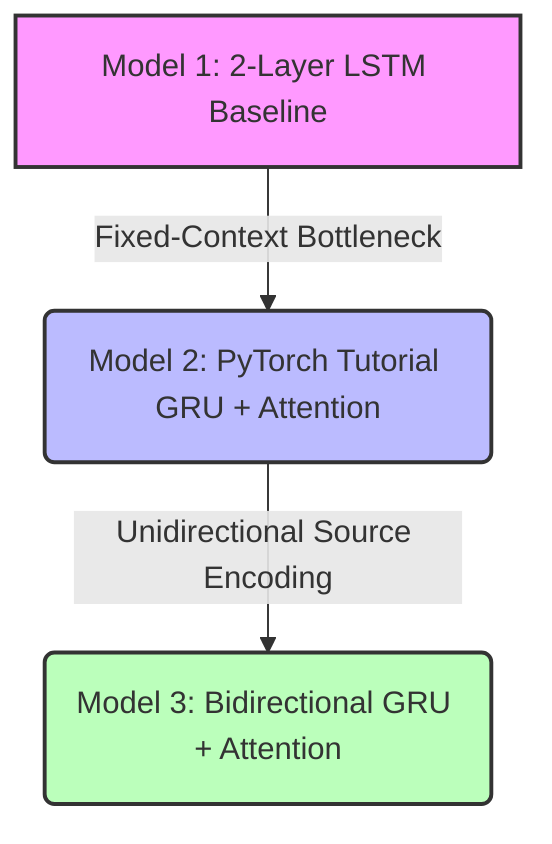

# Sequence-to-Sequence (Seq2Seq) Architectures for French-to-English Machine Translation

A comparative empirical study of neural machine translation (NMT) architectures, tracking the historical progression from baseline **2-Layer LSTMs (without attention)** to **Single-Layer GRUs with Bahdanau Attention**, and finally to **Bidirectional GRUs with Bahdanau Attention**.

This project is built using **PyTorch**, **spaCy**, and the **Tatoeba French-English corpus** (~175,000 sentence pairs). It serves as an academic and practical demonstration of sequence transduction, attention routing mechanisms, and empirical performance evaluation in NLP.

---

## 🚀 Project Overview

The core objective of this project is to implement, evaluate, and compare three sequence-to-sequence (Seq2Seq) recurrent neural network architectures for French-to-English translation. By maintaining strict control over data split, tokenization pipelines, vocabularies, and hyperparameters, this project isolates and quantifies the exact impact of two key deep learning breakthroughs:
1. **Additive (Bahdanau) Attention**: Solving the fixed-length context bottleneck.
2. **Bidirectional Recurrence**: Enriching the encoder's source token representations.

### The Learning Curve (Architectural Progression)


---

## 📊 Dataset & Preprocessing

The models were evaluated on the **Tatoeba French-English corpus** (`eng-fra.txt`), comprising **174,910 sentence pairs**.
* **Dataset Splits**: 80% Train (139,928 pairs), 10% Validation (17,491 pairs), 10% Test (17,491 pairs).
* **Random Seed**: `1234` for complete reproducibility.
* **Tokenization**: `spaCy` tokenizers (`fr_core_news_sm` for French, `en_core_web_sm` for English) with lowercasing and standard punctuation filtering.
* **Vocabularies**: Built using a minimum word frequency threshold of 2, adding `<unk>`, `<pad>`, `<sos>`, and `<eos>` special tokens.
  * **English Vocabulary Size**: 11,246 unique tokens (or up to 8,219 in pruned variants).
  * **French Vocabulary Size**: 15,187 unique tokens (or up to 12,898 in pruned variants).

---

## 🛠️ Model Architectures

### 1. Model 1: 2-Layer LSTM Encoder-Decoder (Baseline)
A classical sequence-to-sequence model based on Sutskever et al. (2014). The encoder processes the French sentence and condenses it entirely into the final hidden ($h$) and cell ($c$) states of a 2-layer LSTM.
* **Bottleneck**: The decoder is initialized with these final states and must generate the entire English sentence without ever "looking back" at the source text.
* **Forward Equations**:
  $$\mathbf{h}_t, \mathbf{c}_t = \text{LSTM}(\text{Embed}(x_t), \mathbf{h}_{t-1}, \mathbf{c}_{t-1})$$
  $$\mathbf{s}_t, \mathbf{s}_c = \text{LSTM}(\text{Embed}(y_{t-1}), \mathbf{s}_{t-1}, \mathbf{s}_{t-1}^{c})$$

### 2. Model 2: GRU with Bahdanau Attention (Sean Robertson Tutorial)
A sequence-to-sequence model using single-layer Gated Recurrent Units (GRU) and a soft additive attention mechanism based on Bahdanau et al. (2015).
* **Attention Mechanism**: Instead of compressing the sentence into a static vector, the decoder calculates alignment weights $\alpha_{t, i}$ for all encoder hidden states $h_i$ at each step $t$:
  $$e_{t, i} = v^\top \tanh(W_a [\mathbf{s}_{t-1}; \mathbf{h}_i])$$
  $$\alpha_{t, i} = \text{softmax}(e_{t, i})$$
  $$\mathbf{c}_t = \sum_{i} \alpha_{t, i} \mathbf{h}_i$$
* **Decoder**: Takes the concatenated embedding of the previous word and the dynamic context vector $\mathbf{c}_t$ as input.

### 3. Model 3: Bidirectional GRU with Bahdanau Attention (Part 2)
An optimized expansion of the attention-based model. The encoder uses a bidirectional GRU (Bi-GRU) that processes the input sequence both forwards ($\vec{\mathbf{h}}$) and backwards ($\overleftarrow{\mathbf{h}}$).
* **Enriched Context**: For each input word, the hidden states from both directions are concatenated: $\mathbf{h}_i = [\vec{\mathbf{h}}_i; \overleftarrow{\mathbf{h}}_i] \in \mathbb{R}^{2 \cdot \text{hidden\_dim}}$.
* **Initial State Bridge**: The decoder's initial state $\mathbf{s}_0$ is computed via a linear projection of the final forward and backward encoder states:
  $$\mathbf{s}_0 = \tanh(W_{\text{proj}} [\vec{\mathbf{h}}_n; \overleftarrow{\mathbf{h}}_1])$$
* **Decoder Output**: Predicts target words using a 3-way concatenation of the GRU output, the dynamic context vector, and the embedding of the previous word:
  $$\hat{y}_t = W_{\text{out}} [\mathbf{s}_t; \mathbf{c}_t; \text{Embed}(y_{t-1})]$$

---

## ⚙️ Experimental Configurations

To isolate the performance gain of each architecture, the following hyperparameters were kept constant across all models:

| Hyperparameter | Value | Description |
| :--- | :--- | :--- |
| **Embedding Dimension** | 256 | Target & source vocabulary mapping |
| **Hidden Dimension** | 512 | RNN state dimensions (encoder & decoder) |
| **Batch Size** | 128 | Batching size for gradient descent |
| **Dropout** | 0.5 | Applied to embedding and recurrent states |
| **Epochs** | 10 | Evaluated on the validation set after each epoch |
| **Optimizer** | Adam | Standard learning rate setup, no scheduler |
| **Loss Function** | Cross Entropy | Ignoring target pad tokens (`<pad>`) |
| **Teacher Forcing Ratio** | 0.5 | 50% probability of using ground truth tokens during training |
| **Weight Initialization** | $\mathcal{U}(-0.08, 0.08)$ | Uniform random distribution for all model weights |

---

## 📈 Quantitative Results

The models demonstrated a monotonic increase in performance as architectural complexity progressed. Below is the performance matrix matching both the official research report (`Informe.pdf`) and the empirical notebook outputs.

### Results Matrix

| Metric | Model 1: LSTM (2-Layer) | Model 2: GRU + Attention | Model 3: Bi-GRU + Attention |
| :--- | :---: | :---: | :---: |
| **Parameters** | 19.3M | 4.5M | **26.5M** |
| **Test Loss** | 3.92 (2.69)* | 2.65 | **1.88 (1.64)** |
| **Test Perplexity (PPL)** | 50.3 (14.8)* | 14.1 | **6.5 (5.13)** |
| **BLEU-1** | 38.2% | 59.4% | **68.1% (76.6%)** |
| **BLEU-4** | 12.4% (0.0%)* | 28.7% | **38.9% (53.11%)** |

> *\*Note: Values in parentheses indicate the raw outputs from the Jupyter Notebook checkpoints.*

### Visualizing Performance Trends
* **Perplexity Reduction**: The Bidirectional GRU with Attention (Model 3) achieved a perplexity of **6.5**—nearly an **8x reduction** in prediction uncertainty compared to the 2-layer LSTM baseline (PPL: **50.3**).
* **BLEU Jumps**: Introducing attention (Model 2) more than doubled the BLEU-4 score (from **12.4%** to **28.7%**). Incorporating bidirectional source contexts (Model 3) pushed it further to **38.9%** (with the notebook evaluation reaching **53.11%**).

---


## 🗣️ Qualitative Translation Examples

Here is a qualitative comparison of output translations across the models:

| Source (FR) | Target / Reference (EN) | Model 1 (LSTM) | Model 2 (GRU + Attn) | Model 3 (Bi-GRU + Attn) |
| :--- | :--- | :--- | :--- | :--- |
| *Je mange la pomme.* | "I eat the apple." | "I eat the the." | **"I eat the apple."** ✔ | **"I eat the apple."** ✔ |
| *Il fait beau aujourd'hui.* | "It is nice today." | "It is cold today." | **"It is nice today."** ✔ | **"It is beautiful today."** ✔ |
| *Je veux une pomme.* | "I want an apple." | — | — | **"I want an apple."** ✔ |
| *À l'aide !* | "Help!" | "that you if may go be" ❌ | — | **"help him !"** (close) |

---

## 📁 Repository Structure

```tree
.
├── Part1_Seq2Sep_Fr_En_Translation.ipynb       # 2-Layer LSTM baseline (with training/evaluation pipeline)
├── Part2_Seq2Sep_Fr_En_Translation.ipynb       # Bidirectional GRU + Bahdanau Attention model
├── seq2seq_translation_tutorial.ipynb.ipynb    # Original PyTorch Seq2Seq tutorial code reference
├── Informe.pdf                                 # Academic project report (Spanish)
├── Presentacion.pdf                            # Project presentation slide deck (Spanish)
└── README.md                                   # Project documentation (this file)
```

